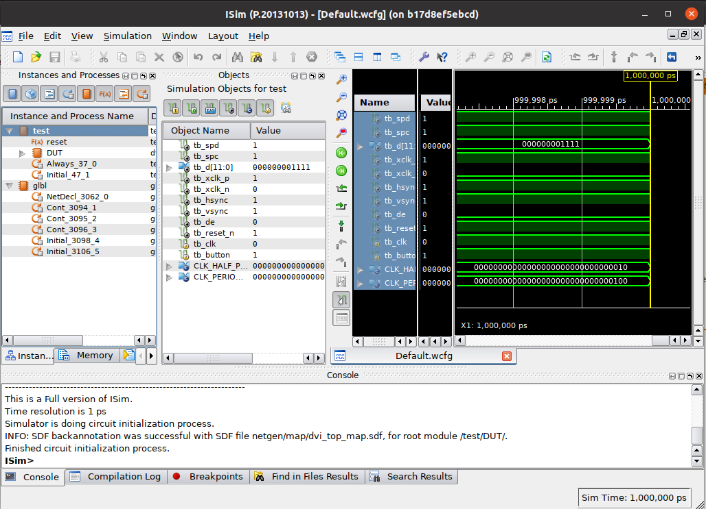
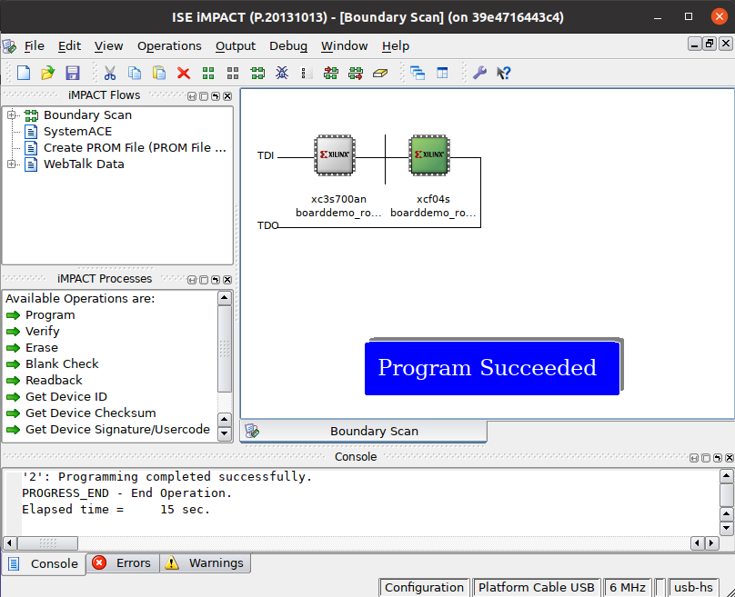
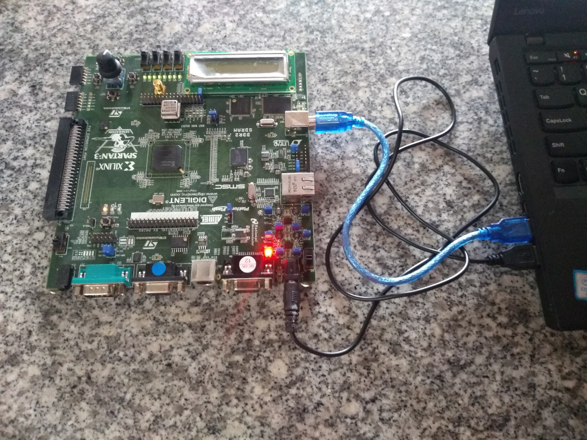

# EDA Tools: Xilinx ISE 14.7
 
When you decide to learn programming digital circuits at first you bump into a big wall, the learning curve is steep and a part of this is the difficulty in creating an environment with the necessary tools to get started.

Despite the efforts of the open source community to support development for the major FPGA vendors, there are not a mature project yet with support for Xilinx FPGAs, that kind of work require a huge amount of reverse engineering effort, luckily there are projects working in this direction like [Project X-Ray](https://github.com/SymbiFlow/prjxray).


If you want to start programming right away on your recently bought [FPGA devkit](https://www.joelw.id.au/FPGA/CheapFPGADevelopmentBoards) or in some [cheap recycled board](https://hackaday.io/project/159853-fpga-board-hack), you will probably get astonished to realize that you need to download about ~15GB of bloatware just to get started and build the simple blinky example, although that logic synthesis and technology mappings are difficult problems they don't require that amount of complexity shifted to the tooling environment setup nor rest it on the newcomer hobbyist/engineer shoulders.

That is why here is a Dockerfile that ease your approach to the FPGA world setting up a working environment with the needed tools to develop on Xilinx FPGAs, it setups the latest ISE version (circa 2013), that is useful when you are playing with Series-6 or below families (Virtex, Spartan, CoolRunner, XC9500, etc). Installing such old software on modern systems is kind of a difficult and tedious task, so I hope these Dockerfiles will be useful for you.

## Downloading from vendor

You can download the needed file [here](https://www.xilinx.com/support/download/index.html/content/xilinx/en/downloadNav/vivado-design-tools/archive-ise.html), there you can find the *ISE archive*, you must chose the version *14.7 Windows 10*, don't worry it is really a Linux version inside a virtual machine.

This version was choosen because it is not the limited *WebPack* version, it comes with an integrated license, in fact the included license file *XILINX.LIC* enables the following components: *ISE*, *PlanAhead*, *ISIM*, *ChipScopePro_SIOTK*, *ChipScopePro*, *XPS*, *SDK*, *SysGen*, *Simulation*, *Synthesis*, *Implementation*, *Analyzer*, *HLS*, also it supports all the devices, such as [Panologic's XC6SLX150 or XC6SLX100](https://github.com/tomverbeure/panologic-g2) which are not supported in the WebPack version.

The file that you need to download and its MD5 sum is:

```
085a59d7e0e33f03eaae730c25f22bd4  Xilinx_ISE_14.7_Win10_14.7_VM_0213_1.zip
```

## Requirements for building

You need ~45GB of free space for the build (excluding the install files (either the VM bundle ~16GB or Installer ~6GB)); the VM bundle method takes me about 2 hours, and the Installer method takes about 1 hour.

## Build the image

For building the base image you need to place the files of this repository and the needed files pointed on the previous section in the same directory, move to that direction and execute:

```bash
docker build -t ise:14.7 .

```

To generate an image tagged **ise:14.7**.

After build the image you can delete the intermediate *builder* tagged image as follow:

```bash
docker image prune --filter label=stage=builder
```

## Running the image
 
There are some scripts provided in this repository to execute the most common ISE tools like *bitgen*, *impact*, *map*, *ngdbuild*, *par*, *xst* and the full GUI *ise* IDE.

They are located in the *shell*, *powershell*, and *cmd* directories, and the main idea is to provide support for Linux Docker and Desktop Docker over WSL2 for Windows users.

There is a main script named ise14[.sh|.ps1|.cmd] that calls `docker run` with the proper environment variables and arguments, also, there are some scripts files in each directory that invoke the ise14 main script referencing the tool to be executed, the idea is that you can access every tool from the host system, it mounts the user context in an ephemeral container and call the tool with the parameters provided on the host call.

### From Linux

In Linux it invokes the scripts passing the whole current user context directly to the container instance, that means it shares: `/etc/passwd` to provide user information, `/etc/group` to provide group information, `/tmp/.X11-unix` to share X's Unix Socket for GUI applications, `$HOME` directory to have access to all user files inside the container instance, and sets `$PWD` as the *current working directory*, so in this way you can execute the tools seamlessly and integrating them in your own build scripts. 

> **Note:** You may need to enable X11 access via `xhost` to allow the container to access the display environment: `xhost +si:localuser:<username>`

This is the main script excerpt to invoke the docker instance:

```bash
export LICENSE_MAC="08:00:27:68:c9:35"
export ISE_PATH="/opt/Xilinx/14.7/ISE_DS"
docker run --rm \
--user $(id -u):$(id -g) \
--mac-address $LICENSE_MAC \
-v /etc/passwd:/etc/passwd:ro \
-v /etc/group:/etc/group:ro  \
-v /tmp/.X11-unix:/tmp/.X11-unix \
-e DISPLAY=$DISPLAY \
-e PATH=/bin:/sbin:$ISE_PATH/ISE/bin/lin64 \
-e LD_LIBRARY_PATH=$ISE_PATH/ISE/lib/lin64:$ISE_PATH/common/lib/lin64 \
-v "$PWD:$PWD" \
-w $PWD \
-v /dev/bus/usb:/dev/bus/usb \
--device-cgroup-rule='c *:* rmw' \
--ipc=host \
-ti $ISE14_IMAGE $@
```

If you have your own license and want to use it, you can overwrite the `LICENSE_MAC` and `XILINXD_LICENSE_FILE` environment variables, LICENSE_MAC is used with the node locked ID of the issued license (the default license has the 08:00:27:68:c9:35 MAC address as node ID), and the XILINXD_LICENSE_FILE variable must point to a valid file inside the docker image (the default is pointed to default one at /opt/Xilinx/Xilinx.lic). The docker command to launch and specify your own license file:

```bash
export LICENSE_MAC="08:00:27:68:c9:35"
export ISE_PATH="/opt/Xilinx/14.7/ISE_DS"
docker run --rm \
--user $(id -u):$(id -g) \
--mac-address $LICENSE_MAC \
-e XILINXD_LICENSE_FILE=/opt/Xilinx/Xilinx.lic \
-v $PWD/Xilinx_2017.lic:/opt/Xilinx/Xilinx.lic:ro \
-v /etc/passwd:/etc/passwd:ro \
-v /etc/group:/etc/group:ro  \
-v /tmp/.X11-unix:/tmp/.X11-unix \
-e DISPLAY=$DISPLAY \
-e PATH=/bin:/sbin:$ISE_PATH/ISE/bin/lin64 \
-e LD_LIBRARY_PATH=$ISE_PATH/ISE/lib/lin64:$ISE_PATH/common/lib/lin64 \
-v "$PWD:$PWD" \
-w $PWD \
-v /dev/bus/usb:/dev/bus/usb \
--device-cgroup-rule='c *:* rmw' \
--ipc=host \
-ti $ISE14_IMAGE $@
```

In order to use the USB Xilinx Platform Cable, you need to pass the USB tree part of the `dev` filesystem with `-v /dev/bus/usb:/dev/bus/usb` and to give access to hot-plugged devices you have to pass the option `--device-cgroup-rule='c *:* rmw'` to allow access to all major and minor character devices.

### From Docker Desktop (Windows)

Running the tools in *Windows Subsystem for Linux 2 (WSL2)* is almost as it is in Linux, but the state of Docker for WSL2 was not the best in my own experience, for example [it was impossible to mount a USB key inside WSL](https://docs.microsoft.com/en-us/windows/wsl/wsl2-mount-disk#limitations) using standard Docker directory mount nor mount the whole device, for this you need at least [Windows Insider preview build 20211](https://github.com/microsoft/WSL/discussions/6061) that you can only get from the [Insider Dev Channel](https://blogs.windows.com/windows-insider/2020/09/10/announcing-windows-10-insider-preview-build-20211/), and when you `docker build` your images it takes ages.

This is the main script excerpt that invoke the docker instance (in the `cmd` version):

```batchfile
docker run --rm ^
--mac-address %LICENSE_MAC% ^
-e DISPLAY=%DISPLAY% ^
-e PATH=/bin:/sbin:/opt/Xilinx/14.7/ISE_DS/ISE/bin/lin64 ^
-e LD_LIBRARY_PATH=/opt/Xilinx/14.7/ISE_DS/ISE/lib/lin64:/opt/Xilinx/14.7/ISE_DS/common/lib/lin64 ^
-e XILINXD_LICENSE_FILE=%XILINX_LICENSE% ^
-v "%CD%:/workspace" ^
-w /workspace ^
-ti %ISE14_IMAGE% %*
```

Like in Linux, the `LICENSE_MAC`, and `XILINXD_LICENSE_FILE` environment variables can be overwrite if you want to use your own license file.

For running the GUI version on Windows you need an X Server like [MobaXterm](https://mobaxterm.mobatek.net/), [Xming](http://www.straightrunning.com/XmingNotes/) or [VcXsrv](https://sourceforge.net/projects/vcxsrv/) properly configured in your system, and pass the `DISPLAY` environment variable to the docker engine. You can edit the script according to your configuration if needed, if you have troubles with this and have doubts about you can look for some tutorials on how to run GUI programs on Docker Desktop.

## Platform Cable

In order to use the *Xilinx Platform Cable*, it is recommended that you deal with firmware flashing on the host rather than inside the docker container, for this you have to perform the following (assuming you are using Ubuntu/Debian):

```bash
sudo apt install fxload
./get_firmwares.sh
sudo cp *.hex /usr/share/ 
sudo cp xusbdfwu.rules /etc/udev/rules.d/
sudo udevadm control --reload
```

What this snippet do is: 
* Install [fxload](https://linux.die.net/man/8/fxload) for firmware management.
* Extract the firmware binaries from the docker image with the provided get_firmwares.sh script.
* Copy them to /usr/share/ directory.
* Copy the provided udev rule to /etc/udev/rules.d/ directory, these rules are in charge of detect the hot plug, load the proper firmware and `chmod` to 666 the device so that you don't need to be root to use it.
* Restart the udev system.

## Notes

The generated image with this Dockerfile consumes 21.3GB, but if you take the same image and trim it for the core functionality in a workflow that don't require ISE GUI, you can get a very small image (I got a working one supporting just XC6SLX150 with **only 220MB!!!**), I have done a lot of Python scripting for this, however you can get the idea of how to do it [here](https://stenci.la/blog/2017-07-docker-with-strace/) or you can get a complete solution for this [here](https://github.com/docker-slim/docker-slim) or [here](https://github.com/ak-1/sackman).

## Screenshot

The ISim simulator:


Impact programming an Spartan3AN device:



My Old Spartan3AN devkit programmed with the Xilinx Platform Cable:



